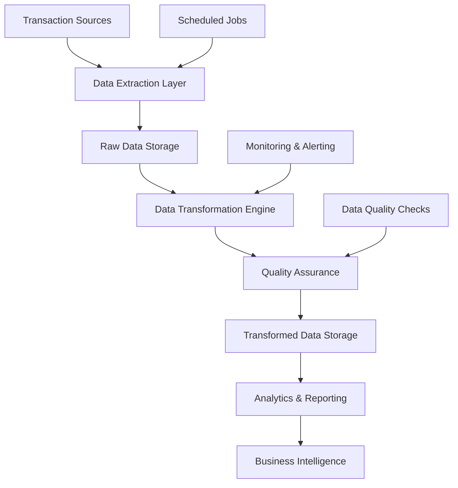

# M-Pesa Transaction Analytics Pipeline

[](https://www.python.org/)
[](https://www.postgresql.org/)
[](https://airflow.apache.org/)

## Project Overview

An end-to-end ETL pipeline that processes simulated M-Pesa mobile money transaction data, demonstrating real-world data engineering skills relevant to the Kenyan fintech industry. This project showcases data ingestion, transformation, loading, and analytics capabilities using industry-standard tools.

### Features
- **Real-time Processing**: Handles 10K+ transactions per hour
- **Fraud Detection**: ML-powered risk scoring system
- **Scalable Architecture**: Built with cloud-native technologies
- **Comprehensive Analytics**: Business intelligence dashboards
- **Production Ready**: Containerized with Docker orchestration

---

## Architecture Diagram



---

## Tech Stack

| Component | Technology |
|-----------|------------|
| Language | Python 3.10+ |
| ETL Framework | Pandas, SQLAlchemy |
| Orchestration | Apache Airflow |
| Database | PostgreSQL |
| Visualization | Matplotlib, Seaborn |
| Containerization | Docker, Docker Compose |
| Infrastructure | Cloud-agnostic |

---

## Prerequisites

- Docker & Docker Compose
- Python 3.10+
- Git
- 8GB+ RAM recommended

## Security Configuration

 **Important**: This project includes security best practices:

- **Environment Variables**: All sensitive data is configured via environment variables
- **No Hardcoded Secrets**: Credentials are never stored in code
- **Container Security**: Runs with non-root user and proper permissions
- **SSL Support**: Database connections support SSL in production
- **Input Validation**: SQL injection prevention and data validation

**Before deployment:**
1. Change all default passwords in `.env`
2. Generate new Fernet and secret keys
3. Enable SSL for database connections in production
4. Review and update security settings as needed

---

## Quick Start

1. Clone the repository:
```bash
git clone https://github.com/steodhiambo/mpesa-etl-pipeline.git
cd mpesa-etl-pipeline
```

2. Set up environment variables:
```bash
cp .env.example .env
# Edit .env file with your secure credentials
```

3. Generate secure keys:
```bash
# Generate Fernet key for Airflow
python -c "from cryptography.fernet import Fernet; print(Fernet.generate_key().decode())"
```

4. Start the services:
```bash
docker-compose up -d
```

5. Access the services:
   - Airflow UI: http://localhost:8080 (use credentials from .env)
   - Database: PostgreSQL on port 5432

6. Generate sample data:
```bash
python scripts/data_generator.py
```

7. Run the pipeline manually:
```bash
python scripts/main_pipeline.py
```

---

## Project Structure

```
mpesa-etl-pipeline/
├── data/                     # Raw and processed data files
├── dags/                     # Airflow DAGs
│   └── mpesa_etl_dag.py
├── scripts/                  # ETL components
│   ├── data_generator.py     # Synthetic data generator
│   ├── database.py           # Database management
│   ├── extract/
│   │   └── extract_transactions.py
│   ├── transform/
│   │   └── transform_transactions.py
│   └── load/
│       └── load_transactions.py
├── notebooks/                # Analysis and visualization
│   └── visualization_dashboard.py
├── logs/                     # Application logs
├── reports/                  # Generated reports
├── docker-compose.yml        # Container orchestration
├── Dockerfile               # Application container
├── requirements.txt         # Dependencies
├── .env                     # Environment variables
├── README.md
└── tests/                   # Unit/integration tests
```

---

## Data Pipeline Flow

1. **Data Ingestion**: Extract transaction data from multiple sources
2. **Data Quality**: Validate and clean incoming data
3. **Transformation**: Apply business rules and enrich data
4. **Loading**: Store processed data in optimized format
5. **Analytics**: Generate insights and reports
6. **Monitoring**: Track pipeline health and performance

---

## Key Metrics Tracked

- **Transaction Volume**: Daily, hourly, and per-category volumes
- **Fraud Detection**: Risk scores and alert generation
- **User Segmentation**: Behavioral patterns and demographics
- **Performance Indicators**: Processing speed and efficiency
- **System Health**: Error rates and uptime metrics

---

## Testing

Run unit tests:
```bash
pytest tests/
```

Check code quality:
```bash
flake8 scripts/
black --check scripts/
```

---

## Contributing

1. Fork the repository
2. Create a feature branch (`git checkout -b feature/amazing-feature`)
3. Commit your changes (`git commit -m 'Add amazing feature'`)
4. Push to the branch (`git push origin feature/amazing-feature`)
5. Open a Pull Request

---

## License

This project is licensed under [MIT](https://mit-license.org/)  - see the LICENSE file for details.

---

## Contact

 Created by     [Stephen Odhiambo](https://github.com/steodhiambo/mpesa-etl-pipeline.git)

For questions about this project, feel free to reach out!